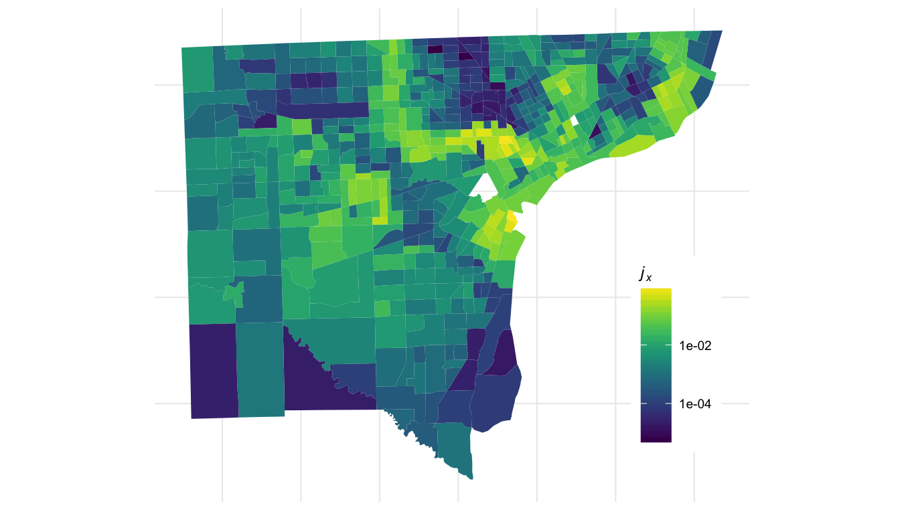
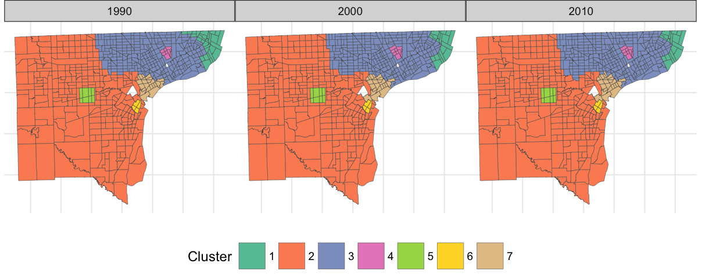

Demographic data is becoming more detailed and more accessible. The new availability of high-quality data has begun to make its mark in quantitative segregation studies. Most studies over the last 30 years has primarily sought to quantify the **magnitude** of segregation in social systems.[^2] The guiding question of such efforts is: 

> **To what degree** is this system segregated?

More recent papers[^3] have brought up a family of questions about the **spatial character** of segregation: 

> 1. At what **spatial scale** is this system segregated?
> 2. Into what **spatial structures** is this system segregated? 
> 3. How do **scale** and **structure** interact? 

# Introducing compx

Modern questions require modern tools. `compx` is an `R` package for analyzing and visualizing spatial segregation using contemporary mathematics and machine learning. The theoretical foundation of `compx` is *information geometry*[^1], a relatively young branch of mathematics that uses the classical tools of differential geometry to learn about probabilistic and statistical models. Our core approach is to treat a map with demographics as a parameterized statistical model, and then use elementary notions of information geometry to learn about it. This approach enables the following two main forms of analysis. 

## Studying Spatial Complexity
How complex are the patterns of segregation in different cities? Where are the spatial "boundaries" between demographic groups?`compx` provides mathematical methods for approaching these questions through the unifying idea of the metric tensor. Learn more about computing, analyzing, and visualizing the metric tensor [here](https://philchodrow.github.io/compx/vignette_metric.html). 

## Spatial Network Analysis

What are the characteristic scales of segregation in a city? How can I visualize these scales? What are the natural spatial clusters from which the city is assembled? `compx` provides tools to approach these questions through network analysis. The core idea is to compute the [*geodesic distance*](https://en.wikipedia.org/wiki/Geodesic) between spatial locales, and use this distance as a graph weighting. 

Various forms of network analysis--such as spectral analysis and community-detection-- can then be used to characterize the spatial structure of segregation. Learn more about constructing, analyzing, and visualizing these networks [here](https://philchodrow.github.io/compx/vignette_clustering.html). 

# Questions, Help, Feedback

I'd love to hear from you! Please reach out through GitHub, or my [website](https://philchodrow.github.io/). 

[^2]: For a helpful review, see Reardon, S. F., & O’Sullivan, D. (2004). Measures of Spatial Segregation. Sociological Methodology, 34(1), 121–162. http://doi.org/10.1111/j.0081-1750.2004.00150.x
[^1]: Amari, S.-I., & Nagaoka, H. (2007). *Methods of Information Geometry.* American Mathematical Society.
[^3]: Such as Reardon, S. F., Farrell, C. R., Matthews, S. A., O’Sullivan, D., Bischoff, K., & Firebaugh, G. (2009). Race and space in the 1990s: Changes in the geographic scale of racial residential segregation, 1990-2000. Social Science Research, 38(1), 55–70. http://doi.org/10.1016/j.ssresearch.2008.10.002

